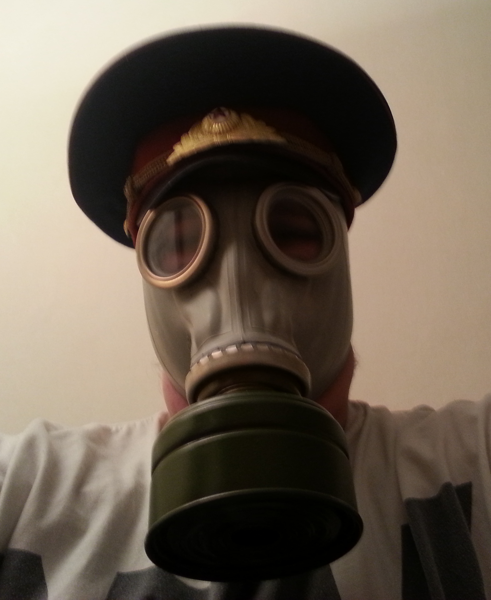

# Dagbok för Aleksander Lundqvist

OSPP (1DT096) 2015 - Grupp 05

## Vecka 16

##### Måndag

2h - projekplanering

##### Tisdag

1h - Bråka med Henrik om språk  
2h - Försöka fatta hur man gör enkel user input i Rust

##### Onsdag

3h - Förberedelse av muntlig presentation

##### Torsdag

##### Fredag

##### Lördag

##### Söndag

1h - Skriftligt presentationsarbete

## Vecka 17

##### Måndag

1h - Random stuff och möte med Karl
1h - Fixa enkel user input i Rust och bli ledsen att vi inte ska använda Rust

##### Tisdag

2h - Gruppmöte med planering av arbetet
2h - Reflektionsarbete

##### Onsdag

1h - Reflektion

##### Torsdag

##### Fredag

7h - Planering och arbete med prototyp.

## Vecka 18

##### Måndag

##### Tisdag

##### Onsdag

##### Torsdag

##### Fredag

## Vecka 19

##### Måndag

##### Tisdag

##### Onsdag

##### Torsdag

##### Fredag

## Vecka 20

##### Måndag

##### Tisdag

##### Onsdag

##### Torsdag

##### Fredag

## Vecka 21

##### Måndag

##### Tisdag

##### Onsdag

##### Torsdag

##### Fredag

## Vecka 22

##### Måndag

##### Tisdag

##### Onsdag

##### Torsdag

##### Fredag

## Vecka 23

##### Måndag

##### Tisdag

##### Onsdag

##### Torsdag

##### Fredag
