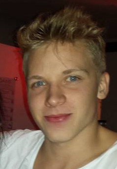

# Dagbok för Förnamn Efternamn

OSPP (1DT096) 2015 - Grupp 05

Gör en kort anteckning i dagboken under aktuell vecka och dag nedan
varje gång du arbetat på projektet.

## Vecka 16

##### Måndag
Idag så har vi endast haft ett möte på en timma, där vi kommit fram till att vi
 ska göra en simulering med myror. 
Först att de ska kunnda gå från sin myrstack och hämta mat, och sedan grafiskt rita
 ut det. 
 Om det går enkelt för sig så ska vi bygga ut det mer allt eftersom.
##### Tisdag

##### Onsdag
Första timmen på dagen har vi lagt på första sidan på våran presention som vi h
ar på torsdag. Planen för idag är att bli klara med redovisningen.
Vi blev klar med det, och delar upp delarna inför redovisningen.
##### Torsdag

##### Fredag

##### Söndag
Idag så har vi skrivit klart den skriftliga delen för projekt förslaget, vi har
 suttit i 5 timmar med texten och diskuterat hur allt kommer 
fungera(system arkitekturen). Och att vi eventuellt ska byta backend språk från
 NIM till erlang. Vi tänker oss att erlang kommer bli 
lite enklare, och att då kan vi förhoppningsvis fokusera mer på våra långsiktig
a mål att ha tex fler myrstackar osv. 
## Vecka 17

##### Måndag

##### Tisdag

##### Onsdag

##### Torsdag

##### Fredag
Har haft en stressig vecka med en hemtenta och en matteinlämning, så det är inte
förns idag jag har haft tid att arbeta på projektet. Vi har idag arbetat med at
t med att göra en enkel prototyp till på måndag. Den skriver ut ett enkelt grid
på 5x5 där vi har endast satt temporära färger på varje cell. Där en myra också
ska röra sig runt. Jag har gjort en modul med funktioner som skickar medelanden
 till celler som ändrar färg på den och en som tar fram pid:en till cellen som 
ligger bredvid. Vi kör nu i erlang och det fungerar bra men knakigt hittils. Jag
har inte hållt på mycket med erlang förns nu, men jag lär mig ganska snabbt och
som sagt har jag redan kommit igång med halv enkla funktioner. 
## Vecka 18

##### Måndag

##### Tisdag

##### Onsdag
Idag så fortsätter vi efter vår första redovisning av prototyp projektet.
Vi ska försöka göra om rätt mycket av prototypen och ge oss på nya utmaningar.
##### Torsdag

##### Fredag

## Vecka 19

##### Måndag
Idag jobbar jag med utils.erl och jag har suttit riktigt länge med det men det har blivit yen bra början. 
Har byggt funktioner som pratar med cellerna och ändrar states i dem etc. Erlang flyter på bra nuförtiden och 
nu är jag oftast en googling iväg från att lösa problem som jag hamnar i.
Det har varit mycket problem med gihub idag och vi har haft en hel del merge conflicts och problem med branches. Och ett mål för dagen är
att ha det fungerande.
##### Tisdag
Idag har vi haft möte och jag och Edvin ska fortsätta med utils den här veckan.
##### Onsdag
Fortsätter med att skapa utils funktioner, Henrik har gjort en type header som jag gör funktioner till de olika typerna.
##### Torsdag
Vi hade möte idag och jag och Edvin har fortsatt med utils. Vi börjar bli klara med det vi kan göra på utils just nu, vi ska prata om
vad vi ska fortsätta med resten av veckan tills på måndag med redovisningen.
##### Fredag

## Vecka 20

##### Måndag
Redovisning idag, det gick bra. Jag, Edvin, Ludde och Oliver ska fortsätta idag med kommunikationen mellan Python och Erlang.
##### Tisdag

##### Onsdag

##### Torsdag
Har varit lite förskyld tidigare i veckan men jag jobbar idag, ska skriva testfall.
##### Fredag
Igår blev det mest fixa med buggar och fick in endast något testfall, idag ska Ludde och Oliver försöka skriva klart det grafiska interfacet 
och jag ska sätta upp message handling mellan dem.
## Vecka 21

##### Måndag
Idag har vi suttit i skolan, har inte jobbat effektivt men har testat en modul vi har hållt på med.
##### Tisdag
Idag har vi kopplat ihop vår gui.erl till python, och det fungerar så vi har en enkel version av grafik nu.
Jag har skapat en mer advancerad version redan som vi måste ordna med python innan vi lägger in den. 
Vi behöver också koppla ihop vår gui.erl till våran andra main modul som hanterar alla celler, men det gör vi imorgon. 
Just nu har vi bara gjort lite hårdkodade tester som fungerar. Men imorgon kommer vi se ifall det vi gjort har blivit bra. 
##### Onsdag
Idag så ska jag koppla ihop grafiken med modulen som skickar medelanden till python, för att sedan koppla den til backend. 
Jag behöver först och främst få erlport att fungera korrekt och bara det har tagit timmar, men så fort jag får igång det ska det inte vara så svårt. 
Och när det sedan är klart är vi kanske klara med vårt första mål att myran hämtar och lämnar mat till boet, det är svårt att se om det fungerar korrekt utan att se grafiken vad som händer.
##### Torsdag
Idag har jag fixat fungerande grafik, och nu märks det lite mer vad som behövs finslipas. 
Vi behöver ändra i tuplar som inehåller information om myror så det är mer klart så man ser när en myra håller på att lämna mat till boet.
##### Fredag
Vi har haft möte idag och bestämmt oss för att börja skriva rapporten och förbereda för presentationen på måndag. 
Koden ska vi lugna ner oss med just nu, vi har iallafall ett grafiskt interface med myror som måste ta sig förbi block för att hitta mat till sin stack. 
Det enda som jag tycker är lite tråkigt är att just nu ser man inte om en myra har hämtat mat, den ska egentligen ha en annan färg. 
Men vi får se ifall vi hinner ordna detta.

## Vecka 22

##### Måndag
Vi har arbetat med rapporten under helgen och jag försov mig till redovisningen.
##### Tisdag

##### Onsdag

##### Torsdag
Vi har börjat med opponeringen idag på grupp ett och två.
##### Fredag
Fortsätter med rapporten idag och skriver på implementiationsdelen.
## Vecka 23

##### Måndag

##### Tisdag
Förberedelse inför redovisningen.
##### Onsdag

##### Torsdag
Idag var det redovisning och det gick bra.
##### Fredag
