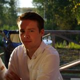
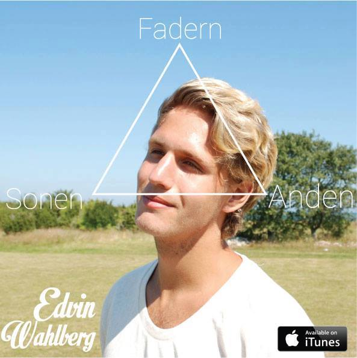

# Medlemmar

OSPP (1DT096) 2015 - Grupp 5

Bild                                       | Förnamn               | Efternamn | Personnummer | Användarnamn (Github)
-------------------------------------------|-----------------------|-----------|--------------|----------------------
  | [Oliver](#oler8065)  | Eriksson Edholm | 930615-5210 | `oler8065`
  | [Aleksander](#tanshinan)  | Lundqvist | 900728-0317  | `tanshinan`
  | [Henrik](#TheGrandmother)  | Sommerland | 890618-4950  | `TheGrandmother`
  | [Ludvig](#ludstr)  | Strömberg | 900220-5632  | `ludstr`
  | [Edvin](#oler8065)  | Wahlberg | 910721-3176 | `vuxnamannen`
  | [Oscar](#oscarwallster)  | Wallster | 9106151096  | `oscarwallster`

##Oliver Eriksson Edholm

### Okänd talang

Snöskottning och reparera kebabsnurror 

### Starka sidor

- samarbete
- analys/design/specifikation
- problemlösning och algoritmer
- rapportskrivande

### Personlig utveckling

- planering
- research (söka och sammanställa information)
- muntlig presentation
- ledarskap
- skriva kod utifrån färdig specifikation

## Aleksander Lundqvist

### Okänd talang

Jag är en mästare på att jaga monster.

### Starka sidor

- analys/design/specifikation
- problemlösning och algoritmer
- skriva kod utifrån färdig specifikation
- planering
- research (söka och sammanställa information)

### Personlig utveckling

- samarbete
- dokumentation
- concurrency

## Henrik Sommerland

### Okänd talang

Jag har kunnat hela filmen High Fidelity utantill.

### Starka sidor

- analys/design/specifikation
- planering
- samarbete
- ledarskap
- research (söka och sammanställa information)
- rapportskrivande
- muntlig presentation

### Personlig utveckling

- Skriva kod med hög kvalitet.
- Utveckla och tillämpa tester.
- Förstå mer om paralellism och concurrency. 

## Ludvig Strömberg

### Okänd talang

Vann skol-DM i snooze.

### Starka sidor

- Problemlösning
- Kreativ
- Samarbete

### Personlig utveckling

- Skriva mer och bättre kod.
- Bli mer strukturerad.

##Oscar Wallster

### Okänd talang

 Revbensspjäll 

### Starka sidor

- analys/design/specifikation
- problemlösning och algoritmer
- skriva kod utifrån färdig specifikation

### Personlig utveckling

- planering
- research (söka och sammanställa information)
- rapportskrivande
- muntlig presentation

## Edvin Wahlberg
### Okänd talang
Jag är en riktig haj på tetris, tackar gymnasiet för det!

### Starka sidor
- Lätt att ha att göra med oftast.

- Jag är rätt bra på att skriva rapporter. 

- Har inga problem med muntliga presentationer.

- Har bra bakgrundsmusiksmak. 

- Tar inte illa vid mig när jag blir rättad även om det är på ett otrevligt sätt. 

### Personlig utveckling

- Försöka lösa problem själv mer och inte be om hjälp eller googla för mycket. 

- Få en vettig dygnsrytm och pluggrutin. 
