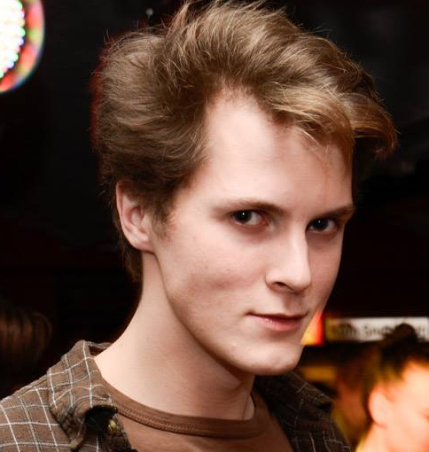

# Medlemmar

OSPP (1DT096) 2015 - Grupp XX

> Ändra XX till numret på gruppen.

> Tag foton av alla medlemmar i gruppen. Varje foto skall visa
> personen framifrån från axlarna och uppåt. Spara bilderna i mappen
> `/meta/images/`.

> Fyll sedan i tabellen nedan. Tabellen skall vara sorterad på förnamn.

Bild                                       | Förnamn               | Efternamn | Personnummer | Användarnamn (Github)
-------------------------------------------|-----------------------|-----------|--------------|----------------------
  | [Anders](#anders877)  | Andersson | YYMMDD-XXXX  | `anders877`
  | [Henrik](#TheGrandmother)  | Sommerland | 890618-4950  | `TheGrandmother`
  | [Oscar](#oscarwallster)  | Wallster | 9106151096  | `oscarwallster`
  | [Aleksander](#tanshinan)  | Lundqvist | 900728-0317  | `tanshinan`
> Utgå sedan från mallen nedan och skapa ett avsnitt för varje medlem
i gruppen sorterade i bokstavsordning  

## Henrik Sommerland

### Okänd talang

Förutom studierna så klättrara och proggramerar jag.

### Starka sidor

- analys/design/specifikation
- planering
- samarbete
- ledarskap
- research (söka och sammanställa information)
- rapportskrivande
- muntlig presentation

### Personlig utveckling

- Skriva kod med hög kvalitet.
- Utveckla och tillämpa tester.
- Förstå mer om paralellism och concurrency. 

##Oscar Wallster

### Okänd talang

> Revbensspjäll 

### Starka sidor

- analys/design/specifikation
- problemlösning och algoritmer
- skriva kod utifrån färdig specifikation

### Personlig utveckling

- planering
- research (söka och sammanställa information)
- rapportskrivande
- muntlig presentation

## Aleksander Lundqvist

### Okänd talang

Jag är en mästare på att jaga monster.

### Starka sidor

> Kortfattad beskrivning över områden där du tror du har lättast att
> bidra till projektet, till exempel:

- analys/design/specifikation
- problemlösning och algoritmer
- skriva kod utifrån färdig specifikation
- planering
- research (söka och sammanställa information)

### Personlig utveckling

> Under projektet hoppas jag förutom att bli ännu bättre på mina redan
> starka sidor även ges möjlighet att utveckla följande färdigheter,
> till exempel:

- samarbete
- dokumentation
- concurrency

## Anders Andersson

### Okänd talang

> Beskriv kortfattad något du gillar att göra vid sidan av dina
> studier.

### Starka sidor

> Kortfattad beskrivning över områden där du tror du har lättast att
> bidra till projektet, till exempel:

- analys/design/specifikation
- problemlösning och algoritmer
- skriva kod utifrån färdig specifikation
- planering
- samarbete
- ledarskap
- research (söka och sammanställa information)
- dokumentation
- rapportskrivande
- muntlig presentation
- lägg gärna till flera punkter ...

### Personlig utveckling

> Under projektet hoppas jag förutom att bli ännu bättre på mina redan
> starka sidor även ges möjlighet att utveckla följande färdigheter,
> till exempel:

- analys/design/specifikation
- problemlösning och algoritmer
- skriva kod utifrån färdig specifikation
- planering
- samarbete
- ledarskap
- research (söka och sammanställa information)
- dokumentation
- rapportskrivande
- muntlig presentation
- lägg gärna till flera punkter ...
